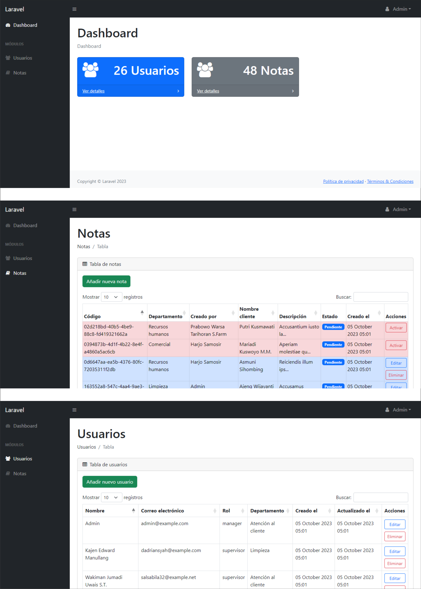

# Laravel departmental notes system with role-based access control

## Requirements

This uses Laravel 10.x, Please make sure your server meets the requirements before installing.
- PHP >= 8.1
- Composer

## Installation

### Clone the repo and cd into it

```bash
git clone https://github.com/pedroriverove/laravel-basic-notes.git
cd laravel-basic-notes
```

### Install composer dependencies

```bash
composer install
```
In this app, we don't use npm or yarn, we use cdn instead

### Create a copy of your .env file
    
```bash
cp .env.example .env
```

### Set your database credentials in your .env file

Change the following lines in your .env file
```conf
DB_CONNECTION=mysql
DB_HOST=127.0.0.1
DB_PORT=3306
DB_DATABASE=your_dbname
DB_USERNAME=your_dbuser
DB_PASSWORD=your_dbpassword
```

### Generate an app encryption key

```bash
php artisan key:generate
```

### Migrate the database and seed

```bash
php artisan migrate
php artisan db:seed
```
Database seeding randomly loads data for the following entities:
* Departments: customer service, human resources, sales, cleaning, recycling plant
* Roles: manager, supervisor, employee
* Users: All users are created with the password: ***password***
* Clients.
* Notes.

### Link storage folder

```bash
php artisan storage:link
```

### Run the server

```bash
php artisan serve
```

## Login credentials for super admin

Visit 127.0.0.1:8000 in your browser and login with the following credentials:
```
email: admin@example.com
password: password
```

## Screenshot


